# Two-Subnet Network with a Linux Router

**Status:** Complete | **Environment:** Oracle VirtualBox (host: Windows 11) | **Cost:** $0

## Document Control

| Field | Value |
|---|---|
| Author | Stefanos |
| Project | Home Lab #1 |
| Last updated | 2026-08-19 |
| Tools | Oracle VirtualBox, Ubuntu Server 26.04 LTS (x3) |

---

## 1. Objective

Build two isolated Ethernet segments and connect them through a Linux router, then prove — with packet-level evidence, not just "it worked" — that hosts on different subnets can only reach each other via the router, and that static routing plus IP forwarding is what makes that possible.

## 2. Network Topology

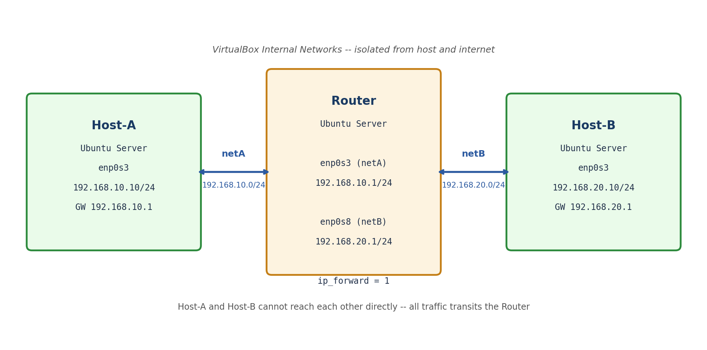

- `netA` and `netB` are VirtualBox **Internal Networks** — fully isolated from each other and from the internet. The only path between them is through the Router.
- The Router runs Ubuntu Server with two NICs, one per segment, and forwards traffic between them at Layer 3.

## 3. IP Addressing & Device Table

| Device | Interface | IP Address | MAC Address | Segment | Role |
|---|---|---|---|---|---|
| Router | enp0s3 | 192.168.10.1/24 | 08:00:27:8a:22:16 | netA | Gateway for Host-A |
| Router | enp0s8 | 192.168.20.1/24 | 08:00:27:30:e8:c2 | netB | Gateway for Host-B |
| Host-A | enp0s3 | 192.168.10.10/24 | 08:00:27:65:18:60 | netA | End host |
| Host-B | enp0s3 | 192.168.20.10/24 | 08:00:27:33:13:aa | netB | End host |

All three VMs run Ubuntu Server (2048 MB RAM, 25 GB disk each).

## 4. Device Configuration

### 4.1 Host-A — `/etc/netplan/00-installer-config.yaml`
```yaml
network:
  version: 2
  ethernets:
    enp0s3:
      addresses:
        - 192.168.10.10/24
      routes:
        - to: default
          via: 192.168.10.1
      match:
        macaddress: 08:00:27:65:18:60
      set-name: enp0s3
```
Applied with `sudo netplan apply`.

| Before (invalid syntax) | After (corrected) | Verified live (`ip a`) |
|---|---|---|
| 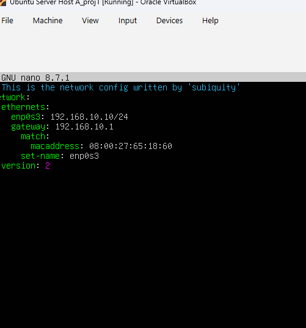 | 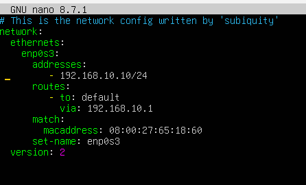 | 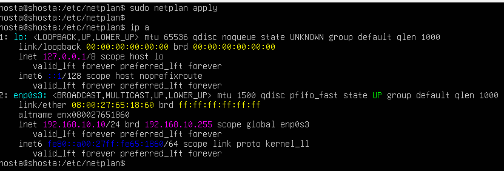 |

### 4.2 Host-B — `/etc/netplan/00-installer-config.yaml`
```yaml
network:
  version: 2
  ethernets:
    enp0s3:
      addresses:
        - 192.168.20.10/24
      routes:
        - to: default
          via: 192.168.20.1
      match:
        macaddress: 08:00:27:33:13:aa
      set-name: enp0s3
```

| Before (empty config) | After (corrected) | Verified live (`ip a`) |
|---|---|---|
| 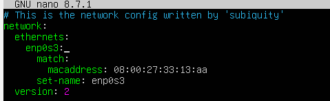 | 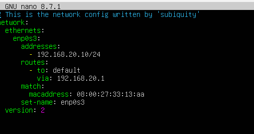 | 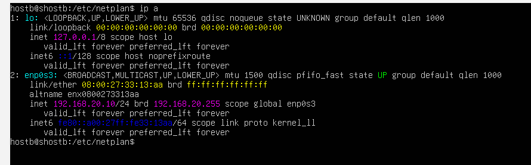 |

### 4.3 Router — `/etc/netplan/00-installer-config.yaml`
```yaml
network:
  ethernets:
    enp0s3:
      addresses:
        - 192.168.10.1/24
    enp0s8:
      addresses:
        - 192.168.20.1/24
  version: 2
```
Applied with `sudo netplan apply`.

| VirtualBox adapter settings | Netplan config (final, confirmed live) |
|---|---|
| 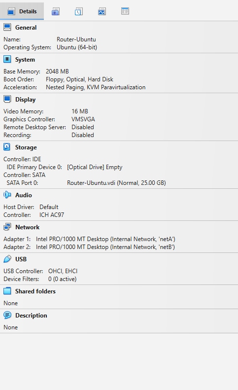 | 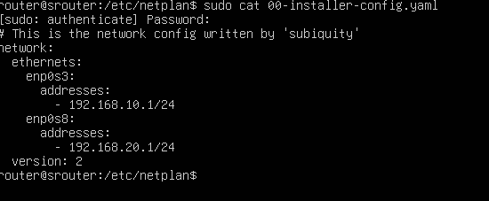 |

### 4.4 IP Forwarding (Router) — `/etc/sysctl.d/99-ip-forward.conf`
```
net.ipv4.ip_forward=1
```
Applied with `sudo sysctl --system`.


> This minimal Ubuntu Server install does not ship a default `/etc/sysctl.conf` — only the `/etc/sysctl.d/` drop-in directory exists. A custom `.conf` file dropped there is picked up automatically by `systemd-sysctl.service` on boot.

**Persistence confirmed with a real reboot** (`sudo reboot`) — both interface addresses and `ip_forward` came back automatically with zero manual steps:

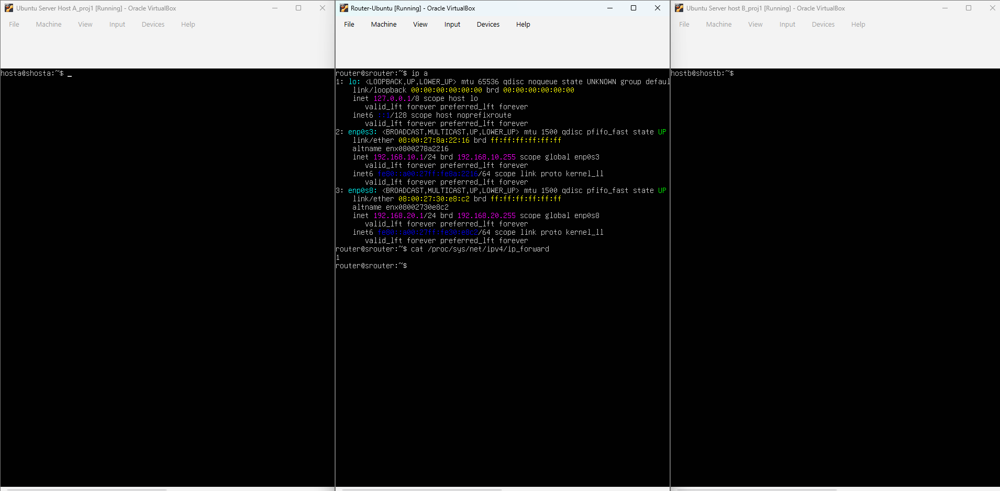

## 5. Verification & Testing

### 5.1 Connectivity (both directions)
```
hosta@shosta:~$ ping -c 4 192.168.20.10
64 bytes from 192.168.20.10: icmp_seq=1 ttl=63 time=4.75 ms
64 bytes from 192.168.20.10: icmp_seq=2 ttl=63 time=2.30 ms
64 bytes from 192.168.20.10: icmp_seq=3 ttl=63 time=1.16 ms
64 bytes from 192.168.20.10: icmp_seq=4 ttl=63 time=1.67 ms
--- 192.168.20.10 ping statistics ---
4 packets transmitted, 4 received, 0% packet loss

hostb@shostb:~$ ping -c 4 192.168.10.10
64 bytes from 192.168.10.10: icmp_seq=1 ttl=63 time=2.00 ms
64 bytes from 192.168.10.10: icmp_seq=2 ttl=63 time=2.13 ms
64 bytes from 192.168.10.10: icmp_seq=3 ttl=63 time=1.80 ms
64 bytes from 192.168.10.10: icmp_seq=4 ttl=63 time=1.95 ms
--- 192.168.10.10 ping statistics ---
4 packets transmitted, 4 received, 0% packet loss
```
**TTL = 63, not 64.** Linux sets the initial TTL to 64; each Layer-3 hop decrements it by one. A TTL of 63 on both sides is direct evidence every packet crossed exactly one router — proof this is routed traffic, not two hosts sitting on the same broadcast domain.

### 5.2 Path Verification (both directions)
```
hosta@shosta:~$ tracepath 192.168.20.10
1:  _gateway    1.502ms
1:  _gateway    1.704ms
2:  ???         4.178ms reached
    Resume: pmtu 1500 hops 2 back 2

hostb@shostb:~$ tracepath 192.168.10.10
1:  _gateway    2.064ms
1:  _gateway    2.093ms
2:  ???         3.338ms reached
    Resume: pmtu 1500 hops 2 back 2
```

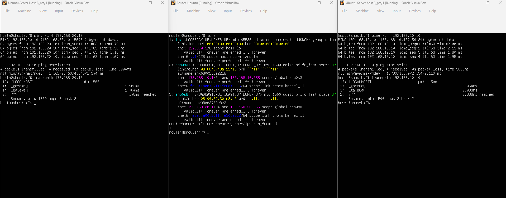
*Both hosts reaching each other in exactly 2 hops via `_gateway`, confirmed from both ends simultaneously, after a full router reboot.*

## 6. Troubleshooting Log

Real issues hit during the build, how they were diagnosed, and how they were fixed — kept here deliberately, since the debugging is as much the point of the project as the working end state.

| # | Symptom | Diagnosis | Root Cause | Fix |
|---|---|---|---|---|
| 1 | All three VMs could see each other directly, defeating the point of the lab | Compared VirtualBox adapter names across all VMs | All three network adapters were joined to the same VirtualBox Internal Network name | Renamed adapters into two distinct segments (`netA`, `netB`) matching the design |
| 2 | Host-B unreachable from Host-A even after IP config | Reviewed Host-B's netplan file | Host-B was mistakenly assigned `192.168.10.20/24` — the netA subnet — despite its adapter being wired to netB | Corrected to `192.168.20.10/24` with gateway `192.168.20.1`, reapplied with `netplan apply` |
| 3 | First netplan attempt on Host-A rejected by `netplan apply` | Reviewed the YAML | IP address assigned directly to the interface name (`enp0s3: 192.168.10.10/24`) instead of nested under `addresses:`, and used an invalid `gateway:` key | Rewrote using `addresses:` (list) and `routes: - to: default / via:` |
| 4 | `sudo sysctl -p` / edits to `/etc/sysctl.conf` kept failing with "No such file or directory" | `ls /etc` | This minimal Ubuntu Server install has no default `/etc/sysctl.conf` — only the `/etc/sysctl.d/` directory exists | Created `/etc/sysctl.d/99-ip-forward.conf` instead and applied with `sudo sysctl --system` |
| 5 | `sudo apt install traceroute` failed on Host-A (`Temporary failure resolving 'archive.ubuntu.com'`) | Expected: Host-A sits on an isolated Internal Network with no route to the internet | Not a defect — isolation is working as designed | Used `tracepath`, which ships with `iputils-ping` and needs no package install |

### 6.1 Troubleshooting Evidence

**Issue 3 — invalid netplan syntax on Host-A**

| Before (rejected) | After (accepted) |
|---|---|
|  |  |

**Issue 4 — missing `/etc/sysctl.conf` on this install**


**Issue 5 — no internet on the isolated segment**

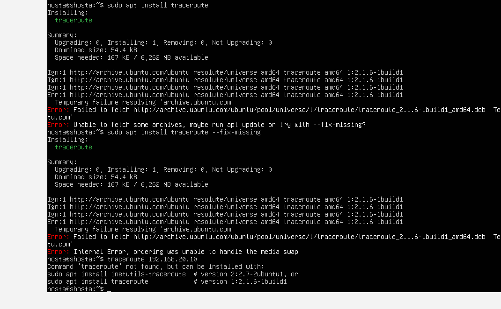

## 7. Lessons Learned / Skills Demonstrated

Subnetting and CIDR addressing, static routing and default gateways, Linux IP forwarding, netplan configuration, VirtualBox virtual networking (Internal Networks), and methodical fault diagnosis using `ip route`, `ip neigh`, `journalctl`, and `tracepath` rather than guessing. Also confirmed, not assumed, that the full configuration — addressing and IP forwarding — survives a real reboot before calling the build done.
